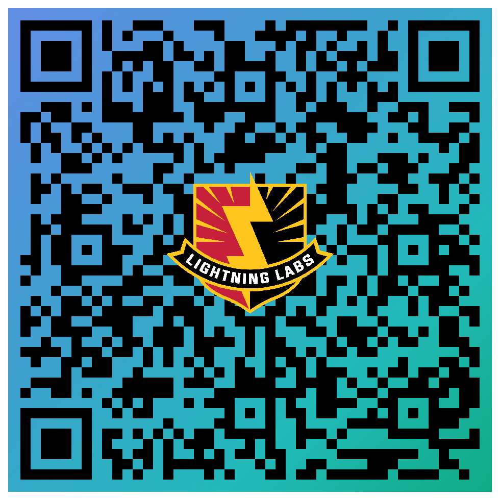

# Lightning Labs SPARK INNOVATION

[Hub Site](https://lightning-labs-softwaredevteam.github.io/LLHubPage/)


**Spark Innovation Chess Game**

Follow this game on [Lichess.org](https://lichess.org/cfmAfj4B)
```pgn
[Event "Innovation Blitz Casual"]
[Site "GitHub README"]
[Date "2024.03.07"]
[Round "?"]
[White "Innovative Strategist"]
[Black "Tactical Stryker"]
[Result "1-0"]

1. d4 d5 2. c4 c6 3. Nc3 Nf6 4. Nf3 e6 5. Bg5 dxc4 6. e4 b5 7. e5 h6 8. Bh4 g5 9. Nxg5 hxg5 10. Bxg5 Nbd7 11. exf6 Bb7 12. g3 Qb6 13. Bg2 O-O-O 14. O-O c5 15. d5 b4 16. Na4 Qa6 17. dxe6 fxe6 18. Bxb7+ Qxb7 19. Qe2 Re8 20. Qxc4 1-0
